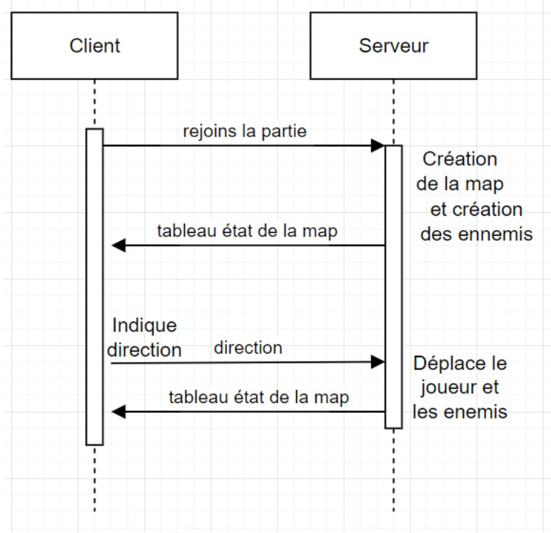

# Projet Pacman 2
## Le but
Joueur en Multijoueur à Pacman grâce à une liaison UDP.
## Le principe ?


*Au minimum* 1 joueur ou plus controlent des Pacmans 

 dont le but est de survivre le plus longtemps sans être touché par un fantôme. Plus longtemp il survit en se déplaçant, plus il marqueras de points.
 Quand le joueur atteind 50 points, il gagne.
 
 .

 La partie s'arrête quand suffisamment de gommes ont été mangées.
## Comment l'utiliser ?
Le jeu fonctionne avec deux machines : un serveur et zéro ou plus clients.

*Il faut donc* **exécuter le fichier _serveur.py_ sur la machine hôte avec cette commande :**
```bash 
python serveur.py
```
ou
```bash 
python3 serveur.py
```

Et **sur la ou les machines clientes** :
```bash
python client.py
```
ou
```bash
python3 client.py
```

Il y aura surement besoin d'installer quelques bibliothèques python.

```bash
pip install keyboard
```
```bash
pip install os
```
```bash
pip install sys
```
```bash
pip install time
```
```bash
pip install random
```

## Les Commandes
- **Z pour avancer tout droit**
- **Q pour aller à gauche**
- **S pour reculer**
- **D pour aller à droite**
- **C pour quitter ( côté client )**

## Diagramme de Séquence
